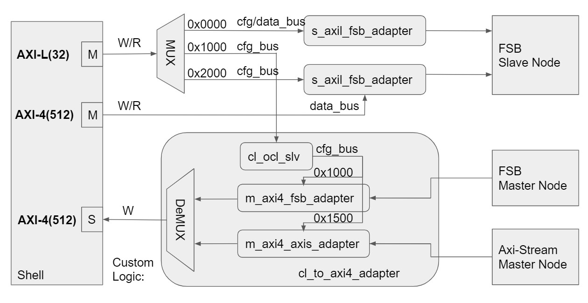

# BSG Custom Logic (CL) AXI to FSB Adapter

This folder contains the design to convert between AXI interface and FSB interface.

- Hardware: Logic Design in verilog
- Software: A DMA write demo in C++
- Testbench: Verification in both rtlsim and cosim

For how to compile and run the simulation in AWS HDK flow, please refer to [this hdk demo](../cl_hdk/README.md).

For more information of AXI interfaces provided by the shell, please refer to [aws-fpga git repository](https://github.com/aws/aws-fpga/blob/master/hdk/docs/AWS_Shell_Interface_Specification.md).

## Contents

1. `Overview`: Block diagram for this design
2. `Functional Description`: Explains the functionality of each block
3. `Testbench`: The test flow

## Overview

Two types of traffics are currently supported between the AWS Shell (SH) and the custom logic (CL)

1. SH writes/reads to the CL. (SH as the master, CL as the slave)
    - AXI-Lite -> FSB: s_axil_fsb_adapter.sv
    - AXI4 -> FSB: s_axi4_fsb_adapter.sv

2. CL DMA writes to the SH. (CL as the master, SH as the slave)
    - FSB -> AXI4: m_axi4_fsb_adapter.sv
    - AXI-Stream -> AXI4: m_axi4_axis_adapter.sv

### Block diagram

## Functional Description
### 1. AXI-Lite to FSB adapter

This module uses Xilinx 'axi_fifo_mm_s' IP to convert memory mapped AXI-Lite access to a AXI-Stream interface and finally to FSB.

FSB data is 80-bit wide by default. So we use the axis_dwidth_converter IP as a 4:1 upsizer, packeting four 32-bit data into one 128-bit date. Then, for simplicity, we handle the data width mismatch by keeping the 80 lowest bits as the payload and throw away the upper 48 bits. Finally we make a 1:4 Downsizer to unpack the 128-bit AXI-Stream data to 32-bit data and send it back to 'axi_fifo_mm_s'. 

### 2. AXI4 to FSB adapter

Similar to point 1 above. The AXI4 interface has a 512-bit TDATA, so we first use the 1:4 Downsizer to get the 128-bit AXIS data and access to FSB interface. A 4:1 Upsizer is then used to packet the stream data to 512 bits again and interface to 'axi_fifo_mm_s'.

### 3. FSB to AXI4 adapter

This module is a FSB DMA write engine. It is configured by OCL AXI-L interface, the same interface as point 1 above. The data is written to SH through a 512-bit PCIM AXI-4 outbound interface in the CL. Thus each AXI-4 packet carries four 128-bit packets from FSB (lowest 80-bit as the payload). 

To start the DMA transfer, wirte the host memory buffer size to the WR_BUF_SIZE register and then set the WR_START register. See [cl_crossbar_tb.sv](./testbenches/rtlsim/cl_crossbar_tb.sv) for detail.

In the process of data transfer, we use `head` to represent the read pointer and `tail` to represent the write pointer. `head` and `tail` are updated by driver(SH)/adapter(CL) after every read/write transaction. The `head` and `tail` should never cross each other.

Interuptions:

The DMA write will pause when either these following 2 situations occur:

1. The buffer becomes full    
    - head < tail && tail >= wr_last_addr

    - head > tail && head - tail <= 0x40 (bytesNum per AXI4 write)

2. The falling edge of FSB valid signal
    - The adapter will push through any received FSB data and use the AXI4 strobe signal to ensure not writing garbage data to the host memory.

    - When valid signal is high again, the adapter will contiune accepting more FSB data and pack it back with the previous 'broken' AXI4 packet. This ensures that every AXI4 write will start from the addresses that are 0x40 bytes aligned, so as not crossing the 4K boundaries and violating [AXI4/PCIe specificatoin](https://github.com/aws/aws-fpga/blob/master/hdk/docs/AWS_Shell_Interface_Specification.md#axi4-error-handling-for-cl-outbound-transactions).

### 4. AXI-Stream to AXI4 adapter

Similar to point 3 above. This module will send two 512-bit data per packet (AXI4 burst of 2).

## Testbench

AXI protocol checker can be used to print the possible AXI4-PCIe violations. To enable this, set the C_PC_MESSAGE_LEVEL parameter of axi_protocol_checker module in sh_bfm.sv.

For useful functions in cosim, please refer to [this doc](https://github.com/aws/aws-fpga/blob/master/hdk/docs/RTL_Simulating_CL_Designs.md).
